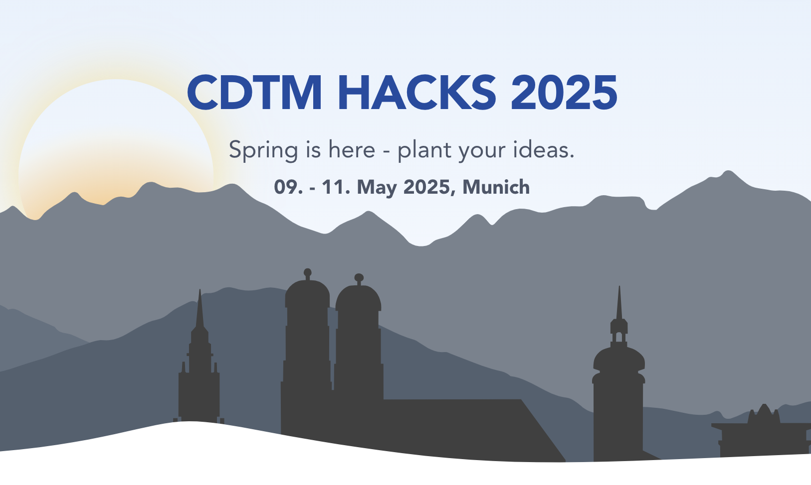

## About

Welcome to the official repository for **CDTM Hacks 2025**! This repository contains the source code and assets for the [CDTM Hacks projects](https://hacks.cdtm.com).

## What is CDTM Hacks?

**CDTM Hacks** is a 36-hour hackathon bringing together the brightest minds from across Germany and Europe to collaborate, innovate, and build impactful solutions. Hosted in the heart of Europe, the event is a unique opportunity for students and tech enthusiasts to tackle real-world challenges provided by industry leaders.

### Key Highlights

- **125 Hackers:** Collaborate with top talent from leading universities and backgrounds.
- **36h Hacking:** Immerse yourself in an intensive weekend of building, learning, and networking.
- **3 Exciting Cases:** Solve real-world challenges from our partners and sponsors.
- **>5,000 € in Prizes:** Win incredible rewards, gain industry recognition, and open doors to new opportunities.

### Speakers & Judges

Meet inspiring founders, investors, and tech leaders from the CDTM ecosystem and beyond.

## How to Participate

- **Event Date:** 09. - 11. May 2025, Munich
- **Application Deadline:** See website for countdown and details
- **Apply:** [hacks.cdtm.com](https://hacks.cdtm.com)

## Repository Structure

- `website/` — Source code for the event website
- `website/public/images/hero.png` — Hero banner used on the website and in this README
- `team-name-checker/` — Source code for the team name checker tool
- `recruiting/` — Some scripts we used during the application process & recruiting of participants

## Contributing

Contributions are welcome! If you've found a bug, typo, or would like to improve the content, please open a pull request or issue on this repository. We'll be happy to review and merge your changes.

---

For more information, visit [hacks.cdtm.com](https://hacks.cdtm.com) or contact us via [hacks@cdtm.com](mailto:hacks@cdtm.com).
